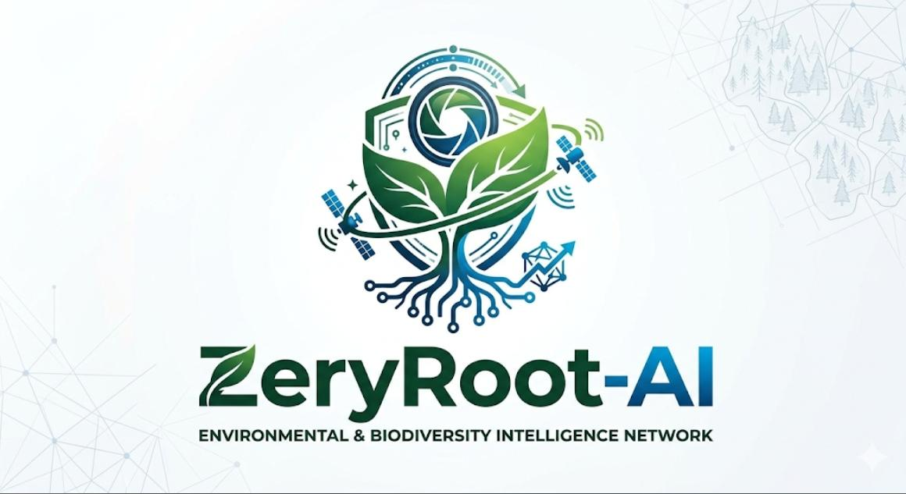

  

<h1 align="center">🌍 ZeryRoot-AI</h1>

<h3 align="center">Rooting Technology in Environmental Intelligence</h3>

🛰️ AI-Powered Environmental & Biodiversity Monitoring Platform

🌿 Detect • Analyze • Predict • Protect

---

## 🌱 About ZeryRoot-AI

ZeryRoot-AI is an intelligent environmental monitoring platform that combines satellite imagery, climate data, and artificial intelligence to monitor ecosystem health, identify environmental changes, assess biodiversity risks, and generate actionable insights for conservation efforts.

Our mission is simple:

> **Detect. Analyze. Predict. Protect.**

---

## 🚨 Problem I Am Solving

Environmental degradation and biodiversity loss are often detected too late, limiting timely conservation efforts and environmental protection.

---

## 💡 My Solution

ZeryRoot-AI continuously analyzes:

- 🛰️ Satellite Imagery
- 🌦️ Climate & Weather Data
- 🌿 Biodiversity Indicators
- 🤖 AI-Based Environmental Analysis

To provide:

- ✅ Environmental Change Detection
- ✅ Biodiversity Risk Assessment
- ✅ Early Warning Alerts
- ✅ Predictive Environmental Intelligence
- ✅ Real-Time Monitoring Dashboard

---

## ✨ Core Features

### 🛰️ Satellite-Based Monitoring
Monitor ecosystem changes across large geographical regions.

### 🤖 AI-Powered Analysis
Identify environmental changes and probable causes.

### ⚠️ Early Warning System
Predict vulnerable environmental zones before significant damage occurs.

### 📊 Smart Decision Dashboard
Provide real-time environmental intelligence for authorities and researchers.

---

## 🏗️ Tech Stack

### Frontend
- HTML
- CSS
- JavaScript
- Bootstrap
- Leaflet.js

### Backend
- Python
- FastAPI
- REST API

### AI / ML
- Python
- OpenCV
- Scikit-Learn

### Database
- Firebase

### Data Sources
- Sentinel-2 Satellite Data
- Google Earth Engine
- OpenWeather API

---

## 🎯 Potential Applications

- Forest Monitoring
- Biodiversity Conservation
- Environmental Risk Assessment
- Government Monitoring Systems
- Conservation Research
- Climate Impact Analysis

---

## 🚀 Development Status

**Current Phase:** Prototype Development

- 🔨 Core System Architecture Completed
- 📡 Satellite Data Integration In Progress
- 🤖 AI Model Development In Progress
- 📊 Dashboard Development In Progress

---

## 🌎 Vision

To build an intelligent environmental monitoring ecosystem capable of protecting biodiversity through real-time data, artificial intelligence, and predictive environmental analytics.

---

## 👨‍💻 Developed By

**Mo Ryan Yunus**

Environment & Biodiversity Innovation Project

---

<b>🌍 Transforming satellite data into actionable environmental intelligence.</b>

